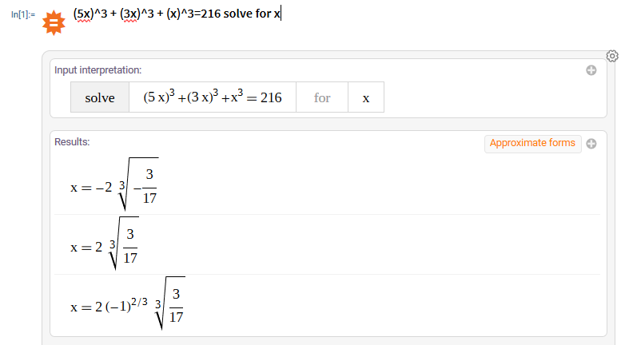
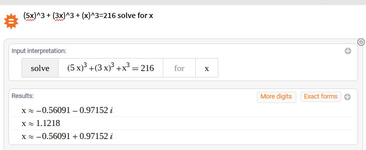
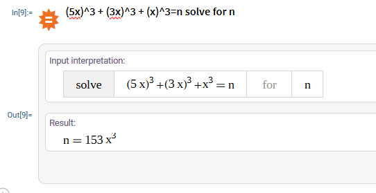

## Using Wolfram One to test your solution

In this short article, we will discuss how Wolfram products can be applied to solve a college-level contest problem. Note that this is not the only possible way to use Wolfram in your contest problems!

## Getting Started

To get started, go to https://one.wolframcloud.com/ and create a new notebook. You may need to register if you haven't already.

Then, create a new Wolfram Alpha Query Section by clicking here or typing `==`:


You should see a little box that you should be able to type in. If you followed the steps correctly, your screen should look like this:


## Solving our first question

Read the following problem, (from UTPC Contest 01-22-21 Div. 1 - Codeforces)

> Dr. Doof is lonely during the winter months, and is sad that his daughter, Vanessa, has not visited him for the holidays. Although a poor replacement, he decides that he wants to build a robot snowman. The structure of a robot snowman consists of a lower body, torso, and head. Each of these components is a solid metal cube with side lengths in ratio 5:3:1. To feel more loved, the good doctor wants to make the largest "snowman" possible to give himself company (while still maintaining the ratio of dimensions). You can help him design this glorious creation by simply knowing the total amount of scrap metal available in cubic meters (Doof uses the metric system, and so should you).

Test case 2 :
> 216

Test case 2 answer:
>1.1218137878

After a bit of initial comprehension, it is easy to see that this problem boils down to the formula `(5x)^3 + (3x)^3 + (x)^3=volume`.

We can verify the correctedness of this approach by simply typing ```(5x)^3 + (3x)^3 + (x)^3=216 solve for x``` into our notebook. You should see something like below.



Notice that our answer is exact, so in order to get the decimal form, hit the `approximate forms` button at the top right of our page. Lo and behold, the correct answer `1.128` is there. Since most programming langauges ignore complex numbers, the only thing left now is to implement your solution.



However, we can also notice that this expression can be simplified due to all coefficients having `x^3` on the right of them. We can simplify this entire expression with just one line: `(5x)^3 + (3x)^3 + (x)^3=n solve for n`



At this point, it should be obvious that `x = (n/153)^(1/3)`

Through this process, we are able to drastically simplify our code to

```cpp
#include <bits/stdc++.h>

int main() {
    long double n; cin >> n;
    cout << cbrt(n/153);
}
```

or in Java

```java
public class Solution {
    public static void main(String[] args) throws IOException {
        Scanner in = new Scanner(System.in);
        double n = in.nextDouble();
        System.out.println(Math.pow(n/153, 1/3));
    }
}
```

This clears all the test cases.